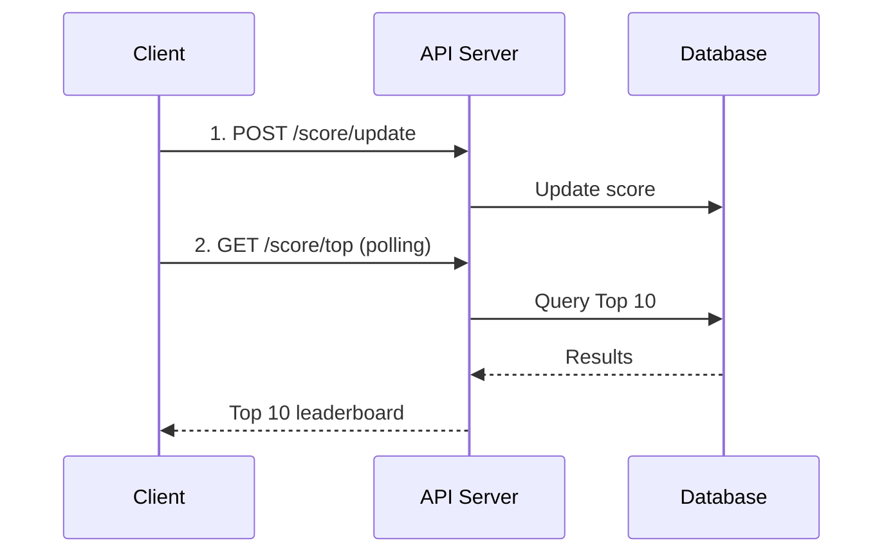
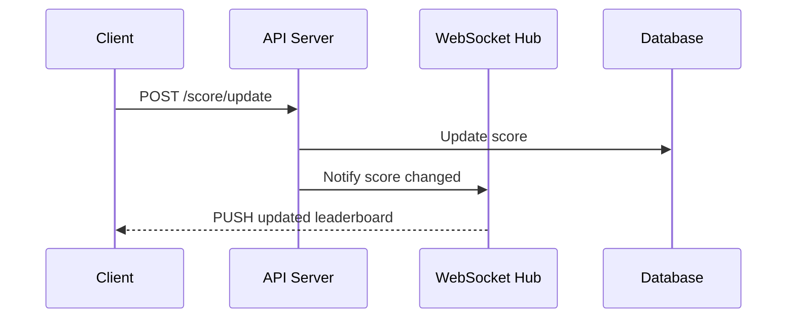
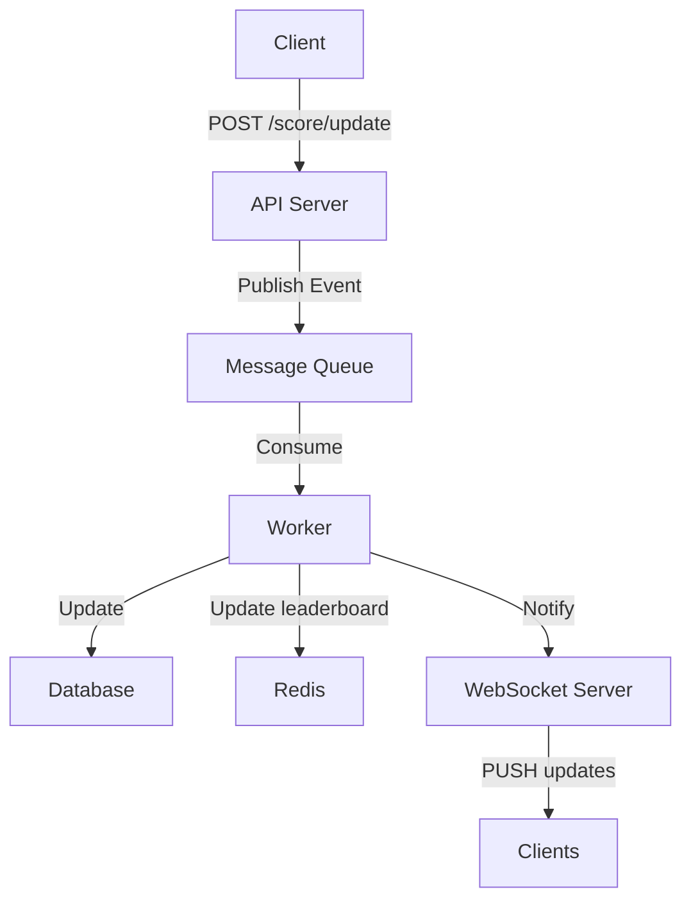
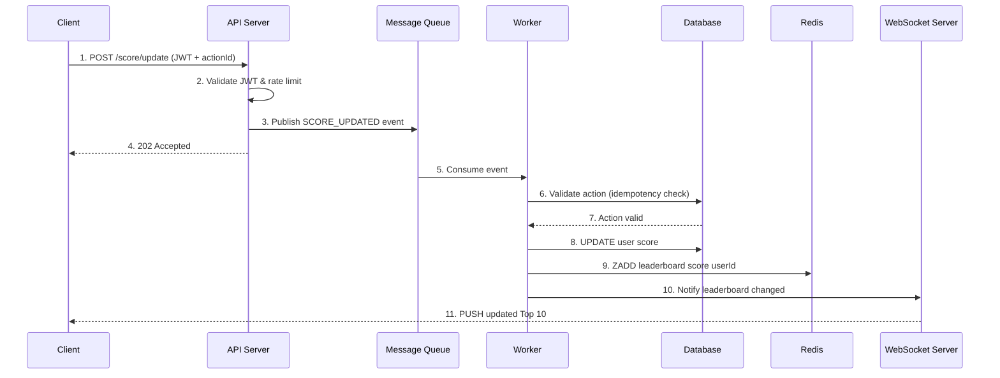
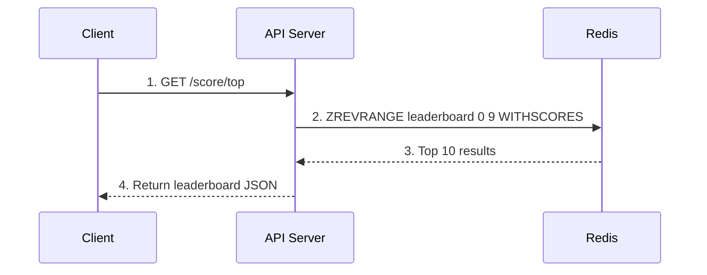
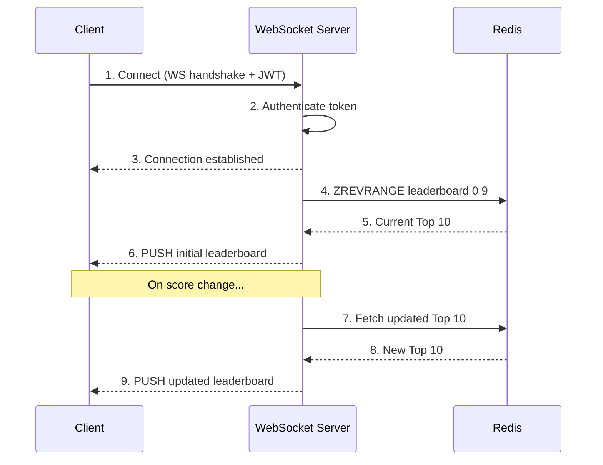
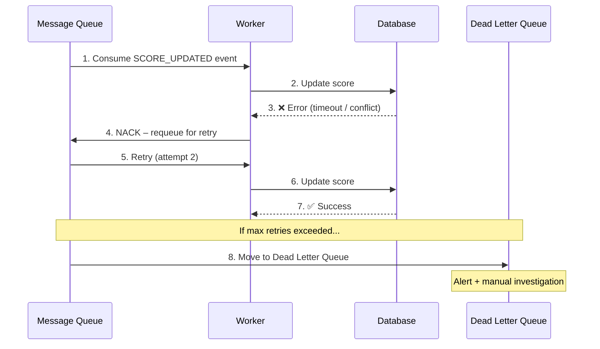

# 🏆 Scoreboard API Module – Technical Specification

## 📌 Overview

This module handles **user score updates** and provides a **real-time top 10 leaderboard**.

### Core Requirements

* Maintain a **Top 10 scoreboard**
* Support **real-time updates**
* Handle **user score increments**
* Prevent **unauthorized / malicious score updates**

---

## 🧱 Module Responsibilities

* Accept score update requests
* Validate and authorize users
* Update persistent storage
* Maintain leaderboard (Top 10)
* Broadcast updates to clients in real-time

---

## 🧪 API Contract

### `POST /api/score/update`

**Request**

```json
{
  "userId": "string",
  "actionId": "string"
}
```

**Headers**

```
Authorization: Bearer <token>
```

**Response**

```json
{
  "success": true,
  "newScore": 120
}
```

---

### `GET /api/score/top`

**Response**

```json
{
  "leaders": [
    { "userId": "u1", "score": 200 },
    { "userId": "u2", "score": 180 }
  ]
}
```

---

## 🟢 Approach 1: Simple (Monolithic + Polling)

### Architecture

* Backend: REST API
* Database: SQL (e.g., PostgreSQL)
* Frontend: Poll every N seconds

### Flow

```
Client → POST /score/update → API → DB (update score)
Client → GET /score/top (polling)
```

### Diagram



### Pros

* Simple to implement
* Easy to debug

### Cons

* Not real-time (polling delay)
* High load with many clients polling
* Inefficient for scaling

---

## 🟡 Approach 2: WebSocket (Real-time)

### Architecture

* Add WebSocket server
* Push updates when score changes

### Flow

```
Client → WebSocket connect
Client → POST update score
API → Update DB → Notify WebSocket → Broadcast leaderboard
```

### Diagram



### Implementation Notes

* Use: Socket.IO / WS / SSE
* On score update:

  * Recompute Top 10
  * Broadcast to all clients

### Pros

* Real-time updates
* Better UX

### Cons

* Still recalculates Top 10 frequently
* Can overload DB under high write volume

---

## 🟠 Approach 3: Cache + Event-driven (Scalable)

### Architecture

* DB (source of truth)
* Redis (leaderboard cache)
* Message Queue (Kafka / RabbitMQ)
* WebSocket server

### Flow

```
Client → API → Publish Event → Queue
Worker → Process → Update DB + Redis
WebSocket → Push updates
```

### Diagram



### Sequence Diagrams

#### Score Update Flow



#### Leaderboard Read Flow



#### WebSocket Connection & Live Updates



#### Failure & Retry Flow



### Implementation Details

#### Redis Leaderboard

Use **Sorted Set (ZSET)**:

```
ZADD leaderboard score userId
ZREVRANGE leaderboard 0 9 WITHSCORES
```

#### Event Example

```json
{
  "type": "SCORE_UPDATED",
  "userId": "u1",
  "increment": 10
}
```

#### Worker Logic

1. Consume event
2. Validate action
3. Update DB
4. Update Redis leaderboard
5. Publish update to WebSocket

---

### Pros

* Scales horizontally
* Fast leaderboard reads (Redis)
* Decoupled system

### Cons

* More complex
* Requires infra (Redis, MQ)

---

## 🔐 Security Considerations

### Prevent Malicious Score Updates

#### 1. Authentication

* Require JWT / OAuth token

#### 2. Action Validation

* Do NOT trust client score
* Server computes score increment

#### 3. Idempotency

* Prevent duplicate actions:

```sql
UNIQUE(actionId, userId)
```

#### 4. Rate Limiting

* Limit requests per user

#### 5. Anti-cheat logic

* Validate action completion server-side
* Example: verify event from trusted service

---

## ⚖️ Comparison of Approaches

| Criteria      | Approach 1 (Polling) | Approach 2 (WebSocket) | Approach 3 (Event + Cache) |
| ------------- | -------------------- | ---------------------- | -------------------------- |
| Complexity    | Low                  | Medium                 | High                       |
| Real-time     | ❌                    | ✅                      | ✅                          |
| Scalability   | ❌                    | ⚠️                     | ✅                          |
| Performance   | ❌                    | ⚠️                     | ✅                          |
| Cost          | Low                  | Medium                 | High                       |
| Best Use Case | MVP                  | Small apps             | Production scale           |

---

## 🚀 Recommended Approach

* Start with **Approach 1 (MVP)**
* Upgrade to **Approach 2** when real-time UX is required
* Move to **Approach 3** when:

  * High traffic
  * Many concurrent updates
  * Need low-latency leaderboard

---

## 🧠 Additional Improvements

### 1. Leaderboard Partitioning

* Weekly / Monthly leaderboard
* Redis keys:

```
leaderboard:global
leaderboard:weekly
```

---

### 2. Pagination for Rankings

* Support rank beyond top 10

---

### 3. Observability

* Metrics:

  * Score update latency
  * WebSocket broadcast time
* Logging:

  * Suspicious activity

---

### 4. Backpressure Handling

* Queue buffering (Kafka)
* Retry failed events

---

### 5. Consistency Strategy

* Eventual consistency (Approach 3)
* Accept slight delay in leaderboard updates

---

### 6. Testing Strategy

* Unit: score calculation
* Integration: DB + Redis sync
* Load test: concurrent updates

---

## 📦 Suggested Tech Stack

* **API**: Node.js (NestJS / Express)
* **DB**: PostgreSQL
* **Cache**: Redis
* **Queue**: Kafka / RabbitMQ
* **Realtime**: WebSocket / Socket.IO
